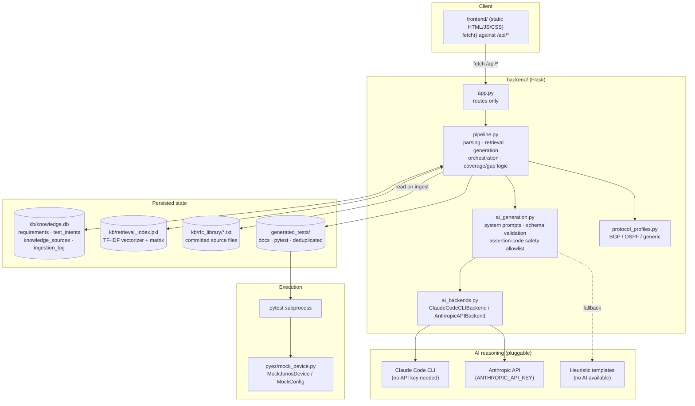
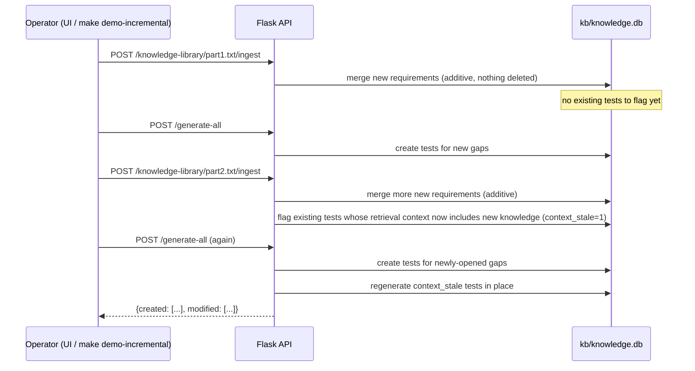

# Design Notes — RFC Conformance Test Generation Prototype

Snapshot of how this codebase currently works, written to orient future changes
(protocol-agnostic refactor, coverage expansion, key-less AI backend, demo
readiness). Source of truth is the code itself — treat this as a map, not a
spec; re-derive details from `backend/pipeline.py` / `backend/ai_generation.py`
before relying on anything below that looks stale.

## What it is

A Flask + SQLite + vanilla-JS proof of concept that turns an RFC's normative
text into a traceable requirement→test pipeline for Juniper vJunos-router/vMX,
with Claude doing the "what test proves this requirement" reasoning. Currently
hard-wired to BGP (RFC 4271) end to end — requirement classification,
generation templates, and the AI system prompt all assume BGP.

## What this POC demonstrates and is capable of

A director-level summary — see "What's real vs. stubbed" near the end of this
document for the full technical detail behind each line.

- **Turns an RFC into a traceable requirement catalog automatically.**
  Uploads or library-selected RFC text get parsed into individually
  identified, individually testable normative statements (`RFC4271-S6.3-
  REQ-42`-style IDs), each carrying its RFC-2119 keyword (MUST/SHOULD/MAY/…),
  a heuristically-assigned category, and whether it's independently
  observable via PyEZ at all.
- **Reasons about each requirement with an LLM, not a template.** Claude (via
  either a local Claude Code CLI login or an API key — see "Key management")
  is given the requirement plus retrieved related context and returns a
  structured, schema-validated Test Intent — never free-form code. Every
  generated test is traceable back to the exact requirement, section, and
  retrieval context that produced it.
- **Adds knowledge incrementally, without losing prior work.** RFC source
  files live in a small library (`backend/kb/rfc_library/`), separate from
  the application code, selectable and ingestable one at a time via an API.
  Ingesting a second file **adds** to the knowledge base rather than
  replacing it — existing requirements and already-generated tests survive.
  If newly-added knowledge changes what an *existing* test's reasoning
  should have seen, that test is flagged and regenerated the next time tests
  are generated — the catalog visibly reports both **new** tests and
  **modified** ones, not just a bigger total.
- **Computes coverage and gaps live, always from the database** — never a
  cached or stale number — and cross-checks remaining gaps against a team's
  own uploaded existing tests (also AI-reviewed) so a gap already covered
  isn't double-counted.
- **Actually runs the generated tests**, for real, via `pytest` against a
  mocked PyEZ layer — not just generates text and calls it done.
- **Is protocol-agnostic in practice, not just in name** — BGP (RFC 4271) and
  OSPF (RFC 2328) both run through the identical pipeline via a
  per-protocol profile, with a generic fallback for anything unrecognized.
- **Runs its AI reasoning step key-less inside Claude Code** — no separate
  `ANTHROPIC_API_KEY` needs to be provisioned to demo real LLM reasoning, and
  every generated test records which backend (or heuristic fallback)
  actually produced it.

## Architecture



**Incremental knowledge-library ingestion** (see the dedicated section below
for the mechanism):



## Runtime shape

```
frontend/ (no build step, static files served by Flask)
  index.html, style.css, app.js  — fetch()-based SPA, 5 tabs (Overview,
  Coverage Matrix, Test Catalog, Gap Analysis, Knowledge Base)

backend/
  app.py            Flask routes only — thin, delegates everything to pipeline.py
  pipeline.py        the actual engine: RFC parsing, requirement extraction,
                      SQLite persistence, TF-IDF retrieval, test generation
                      orchestration, coverage/gap computation, artefact +
                      existing-test upload handling
  ai_generation.py    Claude client, system prompts, JSON schema validation,
                      the assertion-code safety allowlist
  kb/knowledge.db     SQLite — single source of truth after first ingest
  kb/retrieval_index.pkl   pickled TF-IDF vectorizer + matrix
  kb/rfc4271_raw.txt  bundled seed RFC text (read once, by app.py's bootstrap,
                      never again)
  generated_tests/{docs,pytest}/   rendered Markdown + pytest/PyEZ output
```

Boot sequence (`app.py __main__`): if `requirements` table is empty, ingest
the bundled RFC 4271 text, then generate a stratified seed package (up to 3
tests per category) so the dashboard has something to show on first run.
Every subsequent read/generate call only touches `kb/knowledge.db` — this
"parse once, reuse forever" property is treated as structural, not incidental
(see the comments throughout `pipeline.py`).

## Data model (`pipeline.SCHEMA`)

- `rfc_meta` — single-row table: which RFC is currently loaded.
- `requirements` — one row per extracted normative sentence: `requirement_id`
  (`RFC{n}-S{section}-REQ-{nn}`), section id/title, RFC-2119 `keyword`,
  `statement`, a heuristically assigned `category`, and `testability`
  (`automatable` vs `not_independently_observable`).
- `requirement_status` — whether a requirement has a generated test yet
  (`has_generated_test`, `test_id`).
- `test_intents` — the generated test catalog: everything about a test
  (type/risk/priority, rendered doc + pytest text, `generation_mode` —
  `ai-high`/`ai-medium`/`ai-low`/`heuristic-fallback:<reason>` —
  `needs_review`, `requires_peer_emulator`, `emulator_tool`), plus
  `context_requirement_ids` (the retrieval context actually used when this
  test was last generated), `context_stale`/`context_stale_reason`, and
  `updated_at` — see "Incremental knowledge-library ingestion" below.
- `ingestion_log` — append-only activity feed (drives the Knowledge Base tab
  timeline).
- `artefacts` — uploaded product specs / reference docs, extracted text
  cached, used only as extra AI grounding (never touches requirement
  extraction).
- `uploaded_tests` / `uploaded_test_requirement_map` — a team's existing test
  suite, uploaded and AI-reviewed against candidate requirements so real gaps
  can be told apart from already-covered ones.
- `knowledge_sources` — one row per knowledge-library file that has been
  ingested at least once (filename, resolved RFC/protocol, when, how many
  requirements it added) — powers `GET /api/knowledge-library`'s
  ingested/not-ingested status.

## Pipeline stages

**Stage A — Ingest** (`ingest_rfc`, the *only* function that reads raw RFC
text): clean page headers → split into numbered sections (`SECTION_RE`) →
split section bodies into sentences containing an RFC-2119 keyword
(`_split_into_statements`) → classify `category` via keyword/regex rules
(`CATEGORY_RULES`) → classify `testability` via a small denylist of
"implementation-defined" phrasings (`NOT_OBSERVABLE_HINTS`) → persist →
rebuild the TF-IDF retrieval index (`_build_retrieval_index`).

**Stage B — Generate** (`generate_tests`): for each requested requirement id,
pull the 3 nearest neighbors from the same TF-IDF index as retrieval context,
call `ai_generation.generate_ai_test_intent` for a structured Test Intent
(never free-form code — see below), fall back to a static heuristic
(`STEPS_BY_TYPE`/`ASSERTION_BY_TYPE`) if no key/response fails validation,
then render both a Markdown doc and a pytest/PyEZ stub through fixed string
templates (`DOC_TEMPLATE`, `PYTEST_TEMPLATE`).

**Stage C — Coverage** (`get_coverage`, `get_matrix`): always computed live
from the DB — total vs. covered vs. gaps, broken down by category, cross-
checked against AI-reviewed existing-test uploads so a gap already covered by
a team's real test isn't double-counted.

## AI integration (`ai_generation.py` + `ai_backends.py`)

- **Pluggable backend, not a hardcoded client** (`backend/ai_backends.py`):
  `AIBackend` is a two-method interface (`available()`, `complete(system,
  user) -> str`). `ClaudeCodeCLIBackend` shells out to the local Claude Code
  CLI (`claude -p --output-format json --system-prompt ...`), authenticated
  via that session's own OAuth login (`~/.claude/.credentials.json`) — no
  separate key. `AnthropicAPIBackend` is the original direct API call,
  gated on `ANTHROPIC_API_KEY`. Binary discovery order for the CLI backend:
  `CLAUDE_CLI_PATH` override → `CLAUDE_CODE_EXECPATH` (if this process was
  itself launched from inside Claude Code) → known VS Code/Cursor extension
  install globs → `claude` on PATH.
- `ai_generation._select_backend()` picks one per `AI_BACKEND` (env var:
  `auto` default = CLI first, then API key, then heuristic; or `cli`/`api`/
  `heuristic` to force a path). Cached per-process after first check, same
  pattern as the old single-client lazy singleton it replaced.
  `ai_generation.get_active_backend_key()` exposes which one is live, both
  for `/api/status` (`ai.backend`) and per-generated-test provenance
  (`test_intents.ai_backend`, migrated in via `pipeline._migrate` for DBs
  created before this column existed).
- Model: `claude-sonnet-5` by default, overridable via `AI_MODEL` — applies
  to whichever backend answers (CLI accepts the same aliases/full names).
  Was `claude-opus-4-8` originally; changed after a real Claude Code quota
  got exhausted during demo verification (see the "Cost/quota controls"
  note below) — Opus stays available as an explicit override for a real
  presentation, but shouldn't be the thing silently burning quota on every
  rehearsal/bulk-fill run.
- **Design rule that matters:** the model never writes Python. It returns a
  schema-validated JSON "Test Intent" (test type, risk, protocol reasoning,
  steps, PyEZ observation point, and a `checks` list — see below).
  `pipeline.py`'s string templates are the only thing that produce
  doc/pytest text — this keeps "AI reasoning" and "executed code" separated
  by a validated boundary.
- **`checks` schema field (Test Intent) — multiple independent assertions
  per test:** a Test Intent carries a *list* of 1-4 `{description,
  assertion_code}` checks instead of a single assertion. Each check is
  promoted to an executable `assert` line **independently**, gated on
  safety only (see `_safe_assertion_expr` below), not confidence — a check
  that fails validation stays a commented TODO while its sibling checks in
  the same test still run. This replaced an earlier one-slot design where a
  test could structurally have at most 2 asserts total (an always-present
  base sanity check + one AI-suggested one); root-caused against the live
  catalog at the time, 32/39 (82%) generated tests had exactly one `assert`
  statement. Verified the fix by regenerating a fresh batch through the
  real CLI backend: 11/12 tests rendered 2+ real executable asserts (assert
  counts of `{2: 6, 3: 5, 1: 1}` across 12 files), zero referencing an
  undefined name. The one remaining single-assert case was a genuinely
  unassertable MAY-level requirement (no protocol-observable behavior),
  documented as such in its own check rather than padded out.
- `_safe_assertion_expr(code, known_names)` is a narrow AST allowlist (no
  imports, no calls beyond a handful of safe attribute methods — `strip`,
  `lower`, `upper`, `findtext`, `get`, `split`, `count`, `startswith`,
  `endswith`, `replace` — **and every `ast.Name` reference must be in
  `known_names`**) that decides whether a suggested assertion gets promoted
  to an executable `assert` line or stays a commented TODO. Runs once per
  check now, not once per test. `known_names` is `{profile.result_var}`
  plus any variable the model declared via the `observations` schema field
  (see below) — promotion is gated on safety only, **not confidence**; a
  safe assertion from a low-confidence Test Intent still gets promoted, it
  just also keeps `needs_review=1` so a human double-checks the reasoning
  behind it independently of whether it's guaranteed to run without
  crashing.
- **Deeper retrieval context per requirement:** `_generate_one` widened its
  `semantic_search` call (k=4→6, top 4 kept) and added a same-`section_id`
  sibling lookup (`pipeline._same_section_siblings`, a plain SQL query, not
  a retrieval call) so the model sees the full local cluster of related
  MUST/SHOULD clauses in that RFC section, not just cross-similarity hits —
  more raw material to draw distinct checks from.
- **`observations` schema field (Test Intent):** the model can declare up to
  3 named data fetches — `{var_name, source, xpath}` — instead of only ever
  getting the one value auto-fetched via the profile's `observation_call`/
  `observation_field` (`profile.result_var`). `source` is either `"primary"`
  (a different XPath into the same already-fetched response) or a key from
  `profile.secondary_observations` (a small trusted per-protocol menu of
  *additional* RPC calls, e.g. BGP's `route_table` →
  `get_route_information(table='inet.0')`, OSPF's `lsdb` →
  `get_ospf_database_information()`). The model only ever picks a menu key
  and supplies data (a variable name, an XPath string) — `pipeline.py`
  renders the actual fetch code from the trusted profile, never from AI
  text. This exists because the single generic `result_var` is usually too
  shallow to test a specific requirement (e.g. AS_PATH content, an LSA
  field) — before this, the model would invent a plausible-sounding
  variable name for data it had no real way to fetch, and that assertion,
  if promoted, raised `NameError` the moment anyone ran it. Verified fix by
  regenerating all 33 then-existing tests: 36 real `assert` statements
  across 33 files, zero referencing an undefined name.
- Same pattern reused for existing-test coverage review
  (`analyze_existing_test_coverage`): candidates come from the TF-IDF index,
  the model can only tag requirement IDs it was actually offered, response is
  schema-validated, heuristic keyword-overlap fallback if no key.
- **Every AI path has a heuristic fallback** — the app never hard-fails on
  missing/invalid AI output, it just labels the result lower-confidence and
  visibly flags it (`needs_review`, `heuristic-fallback:<reason>` in the
  catalog and doc text, an amber "Heuristic mode" badge in the header).

## Frontend (`frontend/app.js`)

No framework, no build step — plain `fetch()` against the `/api/*` routes
listed in `README.md`. `boot()` loads `/api/status` then `refreshAll()` pulls
coverage/matrix/catalog/ingestion-log/artefacts/existing-tests in parallel and
re-renders every panel. Chart.js for the two Overview charts (category
stacked bar, test-type donut), `marked` + `DOMPurify` to render a generated
test's Markdown doc in the detail modal. Overview tab also has the
Generation Quality panel (confidence/needs-review/emulator-required
distribution, computed client-side from the already-loaded catalog); Test
Catalog tab has the "Run deduplicated tests" button + results table
(`renderRunTestsResult`) that triggers `POST /api/tests/run` and shows
pass/fail/error counts and per-test outcome/message.

## Protocol-agnostic architecture (`protocol_profiles.py`)

The 6 BGP-coupling points originally identified here (category rules, the
two templates, the heuristic-fallback observation/emulator defaults, the AI
system prompt, and header copy) have all been resolved via a
`ProtocolProfile` abstraction:

- **`protocol_profiles.py`** defines one `ProtocolProfile` per protocol:
  `category_rules` (tried before `COMMON_CATEGORY_RULES` — timer/
  message_format/error_handling/capability_negotiation, shared by every
  profile), `topology_key`/`topology_description`, `timer_fields` + a
  per-category override (e.g. BGP shortens `hold` for timer-category tests),
  a `config_template` (Junos config text, rendered via `string.Template`
  — see the note below on why not `str.format()`), `observation_call`/
  `observation_field`/`result_var` (the RPC the rendered pytest stub
  actually executes), `default_emulator_tool`, and `expertise_note` (feeds
  the AI system prompt). `bgp` is extracted verbatim from the original
  hardcoded values; `ospf` (RFC 2328) is the second profile; `generic` is
  the fallback for anything unrecognized.
- **`protocol_profiles.resolve_profile(rfc_number, rfc_title)`** — RFC-number
  match first, then a title-keyword scan, then generic. Called by
  `ingest_rfc()`, which stores the result on `rfc_meta.protocol_key`.
  `pipeline.get_active_profile()` reads it back (falling back to generic if
  unset/unrecognized) for every read/generate path.
- **`pipeline._generate_one`** takes the active profile and uses it for
  every template field that used to be a literal BGP string. **Important
  safety-boundary detail:** the AI's own `pyez_observation` suggestion stays
  advisory documentation only (shown in a comment) — the RPC call the
  rendered pytest stub actually executes always comes from the trusted
  profile, never from AI output. Same pattern as `assertion_code`'s
  AST-safety-checked promotion.
- **`ai_generation.SYSTEM_PROMPT_TEMPLATE` / `COVERAGE_SYSTEM_PROMPT_TEMPLATE`**
  take the profile's topology/expertise/emulator-tool details. Verified
  this isn't just label-deep: prompted with the OSPF profile, the model's
  `protocol_reasoning` for a real OSPF requirement referenced Type-1
  router-LSAs, Router-IDs, and the LSDB specifically.
- **Why `string.Template` (`$name`), not `str.format()`, for config stanzas
  and system prompts:** Junos config text and the JSON schema examples in
  the system prompt are both dense with literal `{`/`}` characters that
  collide with `str.format()`'s field-delimiter syntax (confirmed this
  breaks with a direct repro before picking the fix) — `Template` only
  cares about `$`, so the literal braces need no escaping.
- **Frontend**: `renderHeader()` reads `meta.protocol_display_name` from
  `/api/status` instead of a hardcoded "BGP proof of concept" string; the
  ingest form has an optional protocol-override select.

A migration bug is worth remembering for future schema changes: adding
`rfc_meta.protocol_key` required both an `ALTER TABLE` (DDL) and a backfill
`UPDATE` (DML) in `_migrate()`. `get_conn()` never commits, and several
read-only call sites only `SELECT` + close — so the backfill silently rolled
back the first time, and because the column already existed, the `if column
not in cols` guard meant it would never retry. Fixed by having `_migrate()`
commit its own changes before returning. Any future migration that both
alters schema *and* backfills data needs to do the same — don't rely on the
caller to commit.

A second, more serious bug from the same refactor was caught later, only by
literally running `demo_1.md` end to end (see the demo-validation note in
`todo.md`): the edit that added `get_active_profile()` inserted it in the
middle of `ingest_rfc()`'s body, right after `conn.close()` — splitting off
`ingest_rfc()`'s tail (deleting stale generated test files from the
previous RFC, rebuilding the TF-IDF retrieval index, and the
`return {"requirement_count": ...}` the bootstrap code depends on) as dead,
unreachable code sitting after `get_active_profile()`'s own `return`. The
function still parsed and ran without error — it just silently returned
`None`, never rebuilt the retrieval index, and never cleared old generated
files on re-ingest. This crashed the app's first-run bootstrap outright
(`app.py` unpacks `res['requirement_count']`) and would have silently
broken semantic-search grounding and left stale files behind on every
other re-ingest. Caught and fixed by moving the tail back to the end of
`ingest_rfc()`, where it belongs. Static checks (`ast.parse`, syntax
validation) never catch this class of bug — only actually running the
code path exposes it, which is exactly why `demo_1.md` got run for real
rather than just read for plausibility.

## A confirmed extraction-recall gap (under-segmentation, not loss)

Audited during the coverage-expansion work (see `todo.md` item 2): a naive
whole-document keyword-sentence recount (bypassing section boundaries)
matched the DB's extracted count exactly for RFC 4271 (203=203), so section
splitting isn't dropping text at section edges. But `_split_into_statements`
(pipeline.py) only splits on `". " + capital letter`, so RFC-style lettered/
numbered sub-lists under one lead-in sentence get merged into a single
oversized "requirement" instead of the several independently-testable
statements they contain — e.g. §5.1.2's AS_PATH modification rules (a
`SHALL NOT` for internal peers, plus several distinct external-peer
`SHOULD`/conditional rules enumerated as `a)`/`b)`/`1)`/`2)`/`3)`) all
collapse into one `requirements` row. Nothing is silently missing, but true
requirement count is undercounted and some extracted statements are harder
to test precisely than they should be. Not fixed yet — see `todo.md` for
why (fixing the splitter and re-ingesting would renumber every requirement
ID and orphan already-generated tests, since `ingest_rfc()` wipes
`test_intents` on every re-ingest).

## Bulk generation and coverage (resolved — see `todo.md` item 2)

Wasn't a code defect — the machinery to generate more tests already existed
(`/api/generate-by-category`, matrix drill-down "generate"); the gap was
demo/default state (28 tests, ~14% coverage out of the box) and the fact
that `generate_tests`'s per-requirement loop was fully sequential, making a
196-requirement bulk run impractically slow.

- **`pipeline.generate_all_gaps()` / `POST /api/generate-all`** — bulk-fills
  every remaining automatable gap (optionally capped via `{limit}`) in one
  call; a "Generate all remaining gaps" button in the Gap Analysis tab
  drives it from the UI.
- **Concurrency**: `generate_tests` splits into two phases —
  `_generate_one` (the AI-call + template-render step, touches no shared
  state) runs across a `ThreadPoolExecutor` (`AI_GENERATION_CONCURRENCY` env
  var, default 4); all DB writes and file writes happen afterward,
  sequentially, on the single connection. Real 40-item batch: ~5.3 minutes
  wall time via the CLI backend, all 40 succeeded.
- **Concurrency bug found and fixed**: `ai_generation._select_backend()`'s
  memoization wasn't thread-safe — see the "AI integration" section above.
- **Generation-quality panel** (Overview tab, `app.js:renderGenQuality`,
  computed client-side from the catalog): total/high-confidence/needs-review/
  emulator-required/heuristic-fallback counts, so bulk volume is visibly
  checked against confidence, not just a bigger headline number.
- **`backend/verify_generated_tests.py`** — `ast.parse`s every generated
  pytest stub as a cheap post-generation smoke test.
- Current state after this pass: **77 tests generated, 39.3% automatable
  coverage** (up from 28 tests / ~14%), 119 gaps remaining — bulk-filling
  the rest is a deliberate on-demand action before a demo, not part of
  every fresh install's bootstrap (kept the existing fast-startup seed).

## Incremental knowledge-library ingestion

`ingest_rfc()` above is a **destructive replace**: every call wipes
`requirements`/`requirement_status`/`test_intents`/`rfc_meta` and starts over
— by design, so the paste/upload "replace the knowledge base" UI flow keeps
meaning exactly that. It cannot demonstrate "add more knowledge without
losing existing tests," so it isn't reused for that; a separate, additive
function exists alongside it instead.

- **`backend/kb/rfc_library/`** — a small folder of committed source `.txt`
  files (same category as `kb/rfc4271_raw.txt`, not gitignored runtime
  output), each prefixed with a tiny `RFC_NUMBER:`/`RFC_TITLE:`/`PROTOCOL:`
  header followed by a `---` divider, then the raw RFC text
  (`pipeline._parse_library_file`). Ships two demo files today: RFC 4271
  split at the §6.3/§6.4 boundary (a natural near-50/50 cut verified against
  the real parser — 107 requirements in sections 1–6.3, 96 in 6.4–10).
- **`pipeline.ingest_rfc_incremental(filename, raw_text, source_label)`** —
  the additive counterpart. Extraction itself is shared code
  (`_extract_requirements`, factored out of `ingest_rfc` so both paths parse
  identically), but the per-section requirement-id counters are *seeded from
  what's already in the DB* rather than starting at zero, and only
  requirement_ids not already present get inserted — existing requirements,
  tests, and generated files are never touched. Guards against merging two
  different RFCs into one flat knowledge base (raises, tells the caller to
  use the replace path or reset first) and against a filename that's already
  been ingested being re-processed (idempotent no-op via the
  `knowledge_sources` table — see below for why this matters).
- **"Modified tests" mechanism — `context_stale`:** every generated test now
  stores `context_requirement_ids`, the exact set of requirement IDs that
  were in its retrieval context at generation time (the same
  `_retrieval_context_for` helper `_generate_one` already used, factored out
  so both agree on the definition of "this test's context" — 6 nearest
  TF-IDF neighbors + same-section siblings). After an incremental ingest
  rebuilds the retrieval index, `_flag_context_stale_tests` recomputes that
  context for every existing test; if a newly-added requirement now appears
  in it, the test is flagged `context_stale=1` with a human-readable
  `context_stale_reason`. This is a real signal, not a guess — TF-IDF
  neighbor sets genuinely shift as the corpus grows, and it works whether or
  not the ingested split happens to share a section (the demo split
  deliberately doesn't: verified live, ingesting RFC 4271's second half
  flagged **37 of 102** existing tests stale via cross-section semantic
  similarity alone).
- **`pipeline.regenerate_stale_tests()`** — reuses `_generate_one` (no
  separate rendering path) to regenerate every `context_stale=1` test in
  place: same `test_id`/`requirement_id`, overwritten doc/pytest files and
  `test_intents` row (`UPDATE`, not a new row), `updated_at` stamped,
  `context_stale` cleared. `generate_all_gaps()` (and so `POST
  /api/generate-all`) now runs this as a second pass after its existing
  gap-fill, so one "generate tests" action reports both `created` and
  `modified` — the "few tests modified because of new knowledge" half of the
  demo, alongside the "new tests created" half. Runs across the same
  `ThreadPoolExecutor`/`GENERATION_CONCURRENCY` pattern as `generate_tests()`
  (fan the `_generate_one` calls out concurrently, then write files/DB rows
  back sequentially) — this ran one requirement at a time in the first cut,
  which a real batch caught during live verification (11 flagged tests
  taking noticeably longer than the equivalently-sized "create" pass, since
  neither is CPU-bound); fixed and re-verified (regenerated set matched the
  flagged set exactly; a synthetic-delay timing test confirmed ~2s for 8
  items instead of the ~8s the sequential version would take).
- **Bootstrap conflict, found by actually running this end to end (not just
  reading the diff):** `app.py`'s existing first-run bootstrap ingests the
  *entire* bundled `kb/rfc4271_raw.txt` via the destructive `ingest_rfc()`
  path the moment the DB is empty — which pre-empts the incremental demo
  before it can run a single library call. Fixed with a `SKIP_SEED_BOOTSTRAP`
  env var escape hatch (`Makefile`'s `run-empty` target) rather than
  removing the bootstrap, since `make run`'s normal "seeds itself on first
  launch" behavior is relied on elsewhere and shouldn't change.
- **API**: `GET /api/knowledge-library` (file list + ingested status, scans
  the folder fresh and left-joins `knowledge_sources` in Python), `POST
  /api/knowledge-library/<filename>/ingest` (path-traversal-checked against
  `RFC_LIBRARY_DIR` before reading). **UI**: a "Knowledge library" panel in
  the Knowledge Base tab, and a "modified" pill on any test catalog row with
  a non-empty `updated_at`.
- **Verified live** (see `Makefile`'s `demo-incremental` target): starting
  from an empty knowledge base, ingesting part 1 then generating produced
  102 tests from 107 requirements (5 not independently observable);
  ingesting part 2 added 96 requirements and flagged 37 existing tests
  stale; generating again produced 94 newly-created tests **and** correctly
  regenerated all 37 flagged ones, landing at 196 tests / 100% automatable
  coverage across the full 203-requirement RFC — with zero `ast.parse`
  failures and a clean mocked-`pytest` run afterward.

## Cost/quota controls (`GENERATE_ALL_CAP_ENABLED`/`GENERATE_ALL_CAP_COUNT`)

The incremental-ingestion story above makes it easy to trigger a very large
real-AI batch by design — "ingest more, generate all remaining gaps" is
exactly the point. That's also exactly what exhausted a real Claude Code
quota during demo verification: `generate_all_gaps()`/`POST
/api/generate-all` had no default cap, so two clicks on a freshly-ingested
full RFC could fire 150-200+ real `claude` CLI subprocess calls, each a
real, potentially paid completion — on top of `AI_MODEL` defaulting to the
priciest available tier at the time (`claude-opus-4-8`).

- **`pipeline.GENERATE_ALL_CAP_ENABLED`/`GENERATE_ALL_CAP_COUNT`** (env
  vars, default `true`/`20`): `generate_all_gaps()`'s `limit` parameter now
  has three states instead of two — omitted (apply the env-configured cap,
  or none if disabled), an explicit positive int (used exactly, same as
  always), or `-1` (explicit "generate everything remaining regardless of
  the cap" override). Scoped to this one bulk endpoint specifically, not
  `/api/generate`/`/api/generate-by-category`, which already take an
  explicit caller-controlled count/id-list and aren't the
  silently-fires-100+-calls risk surface. The response gains
  `gaps_remaining_uncapped` (>0 only when the cap actually truncated the
  batch) so a capped run doesn't look like "everything's done" when it
  isn't.
- **`AI_MODEL` default changed to `claude-sonnet-5`** (see the "AI
  integration" section above) — model tier is a far bigger per-call cost
  lever than prompt size, and Opus-by-default meant every rehearsal/bulk-
  fill paid Opus pricing regardless of whether that reasoning quality was
  needed for that particular run. Opus remains a one-line `.env` override
  for an actual presentation.
- **A related, separately-found bug**: `~/.claude.json` (a personal Claude
  Code config, not project source) had `hasTrustDialogAccepted: false` for
  this project path. Under concurrent bulk-generation load, some fraction
  of `claude -p` subprocess calls intermittently failed with a "workspace
  has not been trusted" error and fell back to heuristic mode — wasted
  wall-clock and lower-quality output (though this appears to fail before
  reaching the model, so likely not wasted spend specifically). Fixed by
  setting that one flag to `true` for this project path, equivalent to
  accepting the trust dialog interactively once.
- **What this doesn't fix**: none of the above reduces the token cost of a
  given real AI call — only how many calls happen by default and which
  model tier answers them. If deeper savings are ever needed, the two
  higher-effort levers are switching to `AI_BACKEND=api` (a direct
  Anthropic API call per test, instead of a full `claude` CLI subprocess
  spin-up per test) and adding prompt-caching (`cache_control`) to
  `AnthropicAPIBackend` for the per-protocol system prompt, which is
  currently sent in full on every single call — deliberately not done here
  since it requires provisioning `ANTHROPIC_API_KEY`, trading away the
  key-less demo story for a cost optimization that wasn't asked for.

## Deduplication (`pipeline.refresh_deduplicated_tests`)

Real duplicates were found in the catalog: 29 of the first 77 generated
tests were `heuristic-fallback` (generated before any AI backend existed —
timestamped at the very first bootstrap), and the heuristic path renders
Steps/Assertion text from a fixed 5-entry lookup table
(`STEPS_BY_TYPE`/`ASSERTION_BY_TYPE`, keyed only by `test_type`) rather than
per-requirement reasoning — so any two heuristic tests of the same
`test_type` are byte-identical apart from the requirement ID/statement.

- **`generated_tests/docs` and `generated_tests/pytest` are untouched** —
  they stay the complete, unfiltered record of everything ever generated.
- **`generated_tests/deduplicated/{docs,pytest}`** is a new, additional
  view: `refresh_deduplicated_tests()` (called automatically at the end of
  every `generate_tests()` batch) recomputes it from the *entire* current
  `test_intents` table — not just the latest batch, since a new test can
  duplicate one from an older batch — clears and rewrites both directories
  from scratch each time.
- **`_dedup_key(row) = (test_type, protocol_reasoning.strip())`.** Two tests
  are duplicates if both match. For heuristic tests, `protocol_reasoning`
  is the same fixed string for every heuristic test regardless of
  `test_type`, so `test_type` is what actually separates the 5 real
  duplicate groups; for genuine AI reasoning, `protocol_reasoning` is
  unique per test in practice (verified across every real generation run
  this session), so this key doesn't over-merge real content. Within a
  duplicate group, the earliest-created test is kept as the
  representative.
- Verified with a synthetic duplicate pair injected directly into
  `test_intents` (same `test_type`/`protocol_reasoning`, different
  `requirement_id`): correctly collapsed to 1, `duplicates_ignored: 1`;
  cleaned up after. Real generation runs since then have shown 0 false
  merges among genuine AI content.

## Process log (`backend/logs/generation.log`)

A real file on disk, separate from the in-DB `ingestion_log` table the
dashboard reads. `pipeline._setup_process_log_file()` attaches a
`FileHandler` to the `pipeline` and `ai_generation` loggers **by name**
(not the root logger), so Flask/werkzeug's own request logging isn't
pulled in. Records, at INFO level: every RFC ingest, every generated
test's outcome — explicitly **which backend answered or that it fell back
to heuristic** (`"{rid}: generated via AI backend '{backend}' (mode=...)"`
vs. `"{rid}: AI unavailable/failed ({mode}) -- used heuristic fallback"`) —
batch start/end summaries, and dedup refresh results. Gitignored like
other runtime output (`backend/logs/`).

## Running the tests (`pyez/mock_device.py`, `pipeline.run_deduplicated_tests`)

Closes the loop from "generate a test" to "prove it actually runs,"
without a real vJunos-router/vMX lab:

- **`backend/pyez/mock_device.py`** — `MockJunosDevice` (constructor
  signature matches `jnpr.junos.Device`; `.open()`/`.close()` are no-ops,
  `.rpc` dynamically returns a `MockRpcResponse` for any attribute
  access, mirroring PyEZ's per-RPC-tag method pattern) and `MockConfig`
  (context manager; `.load()`/`.commit()` record but don't apply
  anything). `MockRpcResponse.findtext(xpath)` pattern-matches the XPath
  string (`peer-state`→`"Established"`, `neighbor-state`→`"Full"`,
  `as-path`→`"65001"`, `sequence-number`→`"0x80000001"`, etc.), falling
  back to a generic placeholder — a demo/smoke-test double, explicitly
  **not** a protocol simulator; it can't fabricate a real negative-path
  outcome for a test that actually needs a peer emulator to construct its
  stimulus.
- **Injection mechanism**: `refresh_deduplicated_tests()` writes a
  `conftest.py` into `generated_tests/deduplicated/pytest/` on every
  refresh (its `*.py`-glob cleanup would otherwise delete it, so it can't
  be a plain static file living there — `pipeline.CONFTEST_CONTENT` is
  rewritten alongside the tests each time). That `conftest.py` shims
  `sys.modules["jnpr.junos"]`/`sys.modules["jnpr.junos.utils.config"]`
  with the mock classes *before* pytest imports the generated test files
  (conftest.py always loads first for its directory) — PyEZ isn't a real
  project dependency, so there's nothing genuine to conflict with.
- **`pipeline.run_deduplicated_tests()`** shells out to a real `pytest`
  subprocess (`sys.executable -m pytest ... --junitxml=...`) against
  `generated_tests/deduplicated/pytest` — a genuine test run, not a
  simulation of one. Parses pytest's own built-in JUnit XML report (no
  extra plugin dependency) into a structured pass/fail/error summary with
  per-test duration and failure message. New dependency: `pytest>=8.0.0`
  (`backend/requirements.txt`) — the app itself never imported it before.
- **API**: `POST /api/tests/run`. **UI**: "Run deduplicated tests" button +
  results table in the Test Catalog tab (`app.js:renderRunTestsResult`).
- **Verified live, twice** (direct call and real HTTP): 39 tests, 36
  passed, 0 errored — 0 errored is the important number, since a broken
  mock injection would show up as 39 import errors, not partial failures.
  The 3 failures were inspected and are legitimate, not bugs: one expects
  a route to be genuinely absent (the generic mock always returns a
  placeholder instead), one expects a rejected/non-Established outcome
  from a test that actually needs a peer emulator to construct its real
  stimulus, one expects an exact literal IP the mock was never told about.
  This is stated plainly in the UI description and README, not hidden.

## Key management today

`ANTHROPIC_API_KEY` lives in `backend/.env` (gitignored per the README's
instruction, `.env.example` is the committed template), loaded via
`python-dotenv` at process start. No key → heuristic mode, clearly badged.
This is the thing item 3 of the plan (see `todo.md`) wants to change: running
inside a VS Code/Claude Code environment that's already authenticated
shouldn't require provisioning and storing a second, separate Anthropic API
key for this POC to demo AI reasoning.

## What's real vs. stubbed (carried from README, still accurate)

Real: RFC→requirement extraction, persistent KB, TF-IDF retrieval, AI Test
Intent generation with schema validation + safety-checked assertions, live
generation from the UI, coverage/gap computation, existing-test upload +
AI-reviewed coverage mapping, RFC re-ingestion, deduplication, and now
**actual test execution** — `generated_tests/deduplicated/pytest` runs for
real via `pytest` against a mocked PyEZ layer, no lab required.

Stubbed: generated pytest files use placeholder lab host/credentials for
*real* execution — wiring to an actual vJunos-router/vMX lab still means
swapping the mock back out for real PyEZ/device credentials; negative/
boundary/malformed-message tests still need a peer emulator (ExaBGP/Scapy)
that this tool identifies the need for but doesn't generate, and the mock
runner can't fake that outcome either (see the "Running the tests" section
above — those specific tests may pass or fail against the mock without
that meaning anything about real conformance). Confidence still drives
`needs_review` independently of whether an assertion was safe enough to
promote to executable — a promoted, passing-against-the-mock assertion
from a low-confidence Test Intent is still flagged for a human to check
the reasoning behind it.
